# Application Execution Flow

Complete visual guide to CineHub Pro's application execution flow with detailed Mermaid diagrams.

## Table of Contents

- [Complete Request-Response Flow](#complete-request-response-flow)
- [User Authentication Flow](#user-authentication-flow)
- [Movie Discovery Flow](#movie-discovery-flow)
- [Watchlist Management Flow](#watchlist-management-flow)
- [Review Posting Flow](#review-posting-flow)
- [Caching Strategy Flow](#caching-strategy-flow)
- [Real-time Update Flow](#real-time-update-flow)
- [Image Processing Flow](#image-processing-flow)

---

## Complete Request-Response Flow

### End-to-End Data Flow

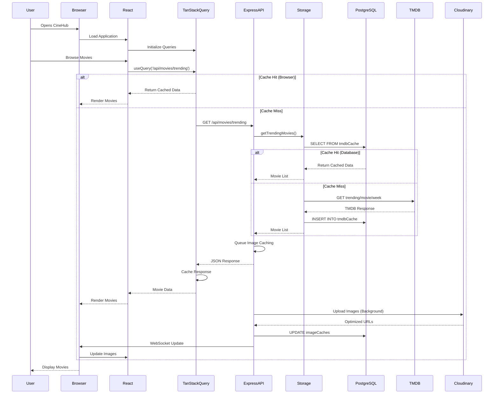

---

## User Authentication Flow

### Sign Up Process

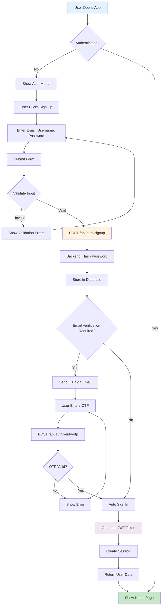

### Login Process

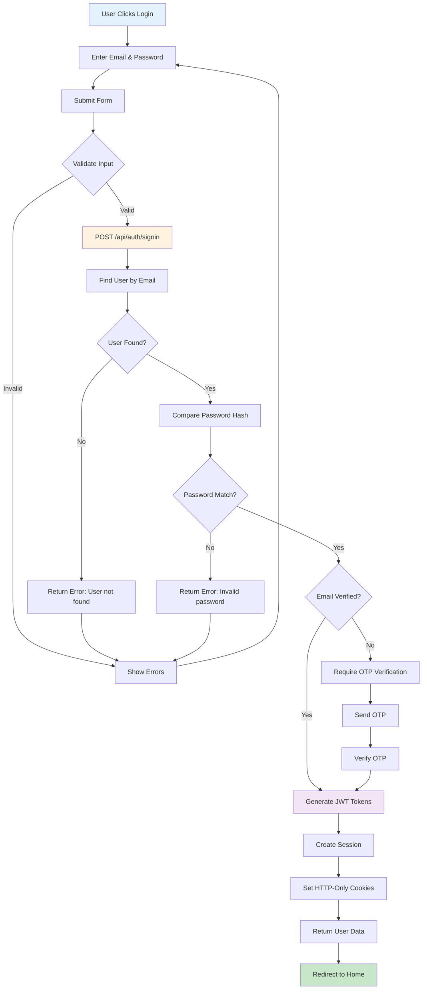

### Social Login Flow (OAuth)

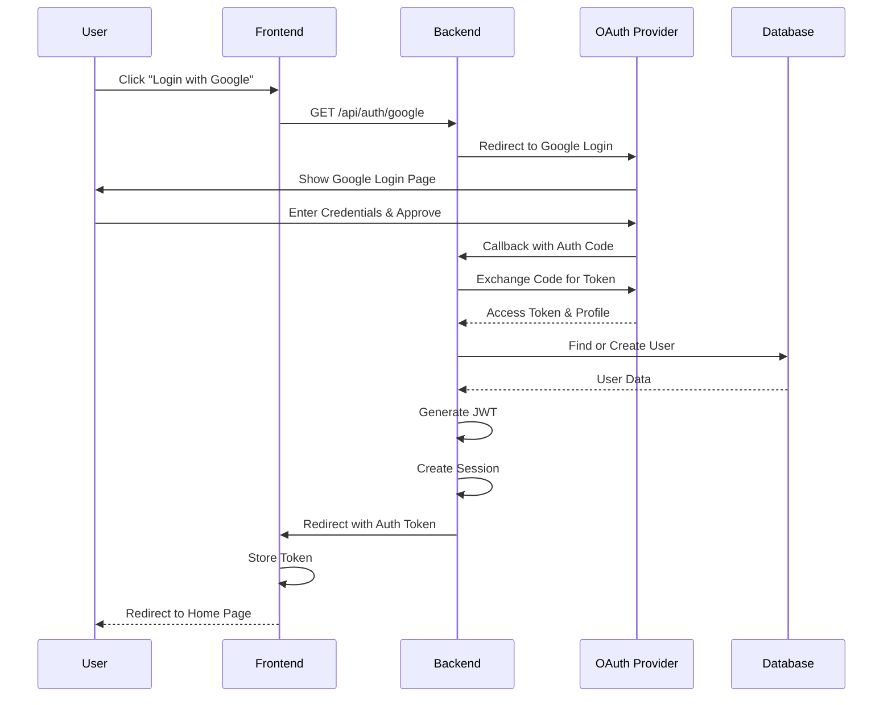

---

## Movie Discovery Flow

### Browse and Filter Movies

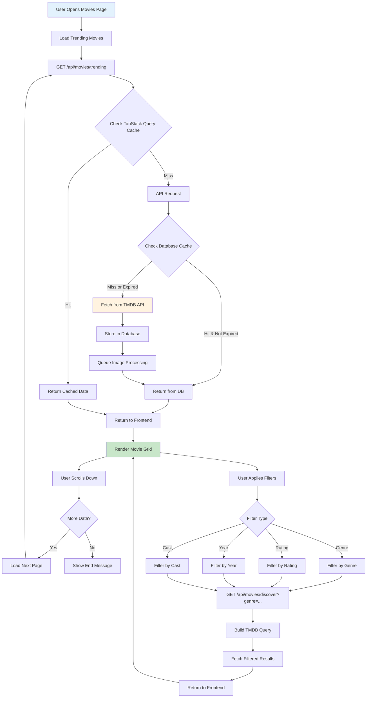

### Movie Details Page

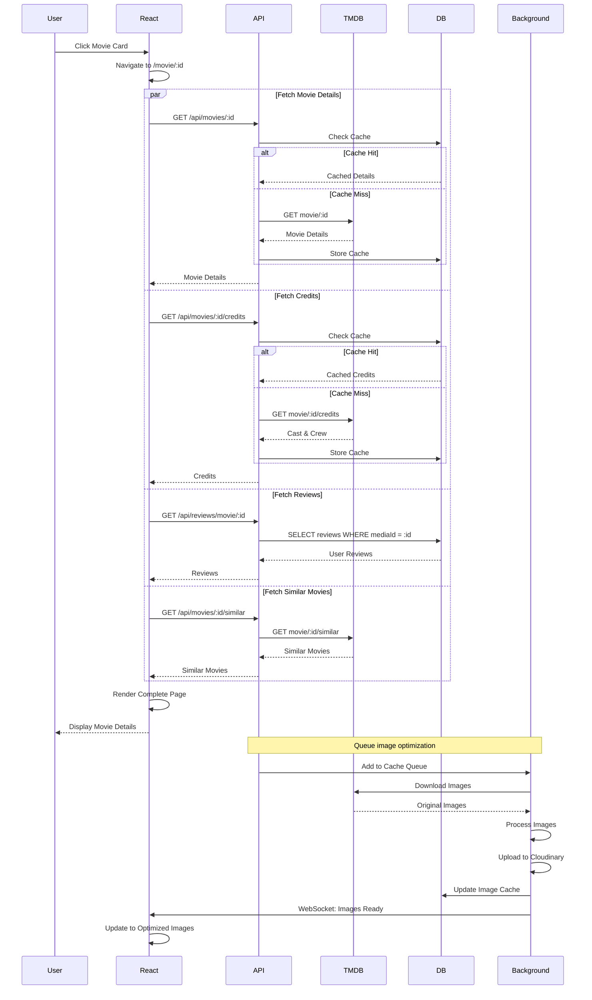

---

## Watchlist Management Flow

### Add to Watchlist

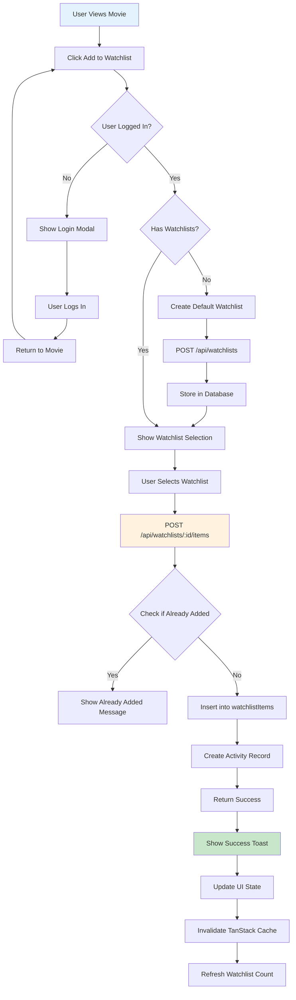

### View Watchlist

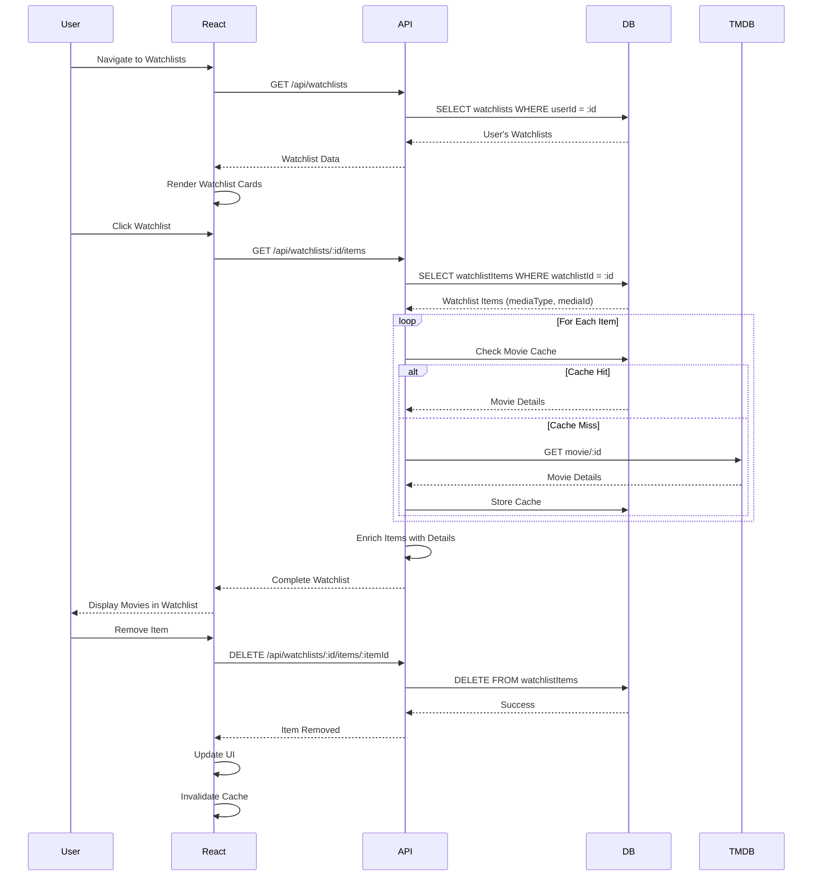

---

## Review Posting Flow

### Write and Submit Review

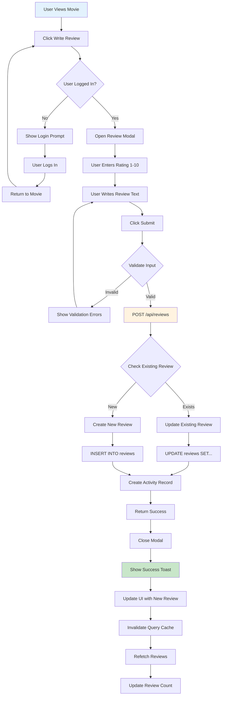

---

## Caching Strategy Flow

### Three-Layer Caching

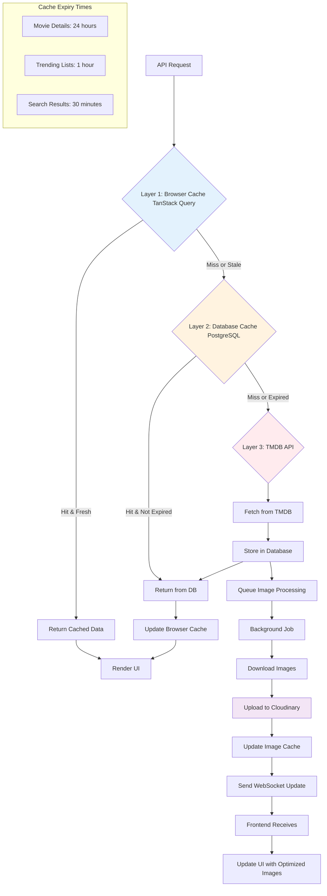

### Cache Invalidation

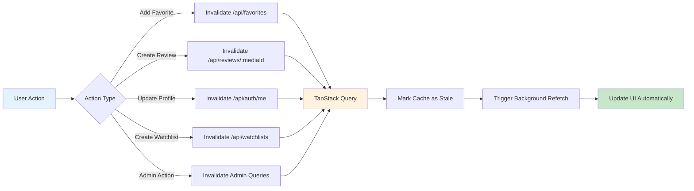

---

## Real-time Update Flow

### WebSocket Communication

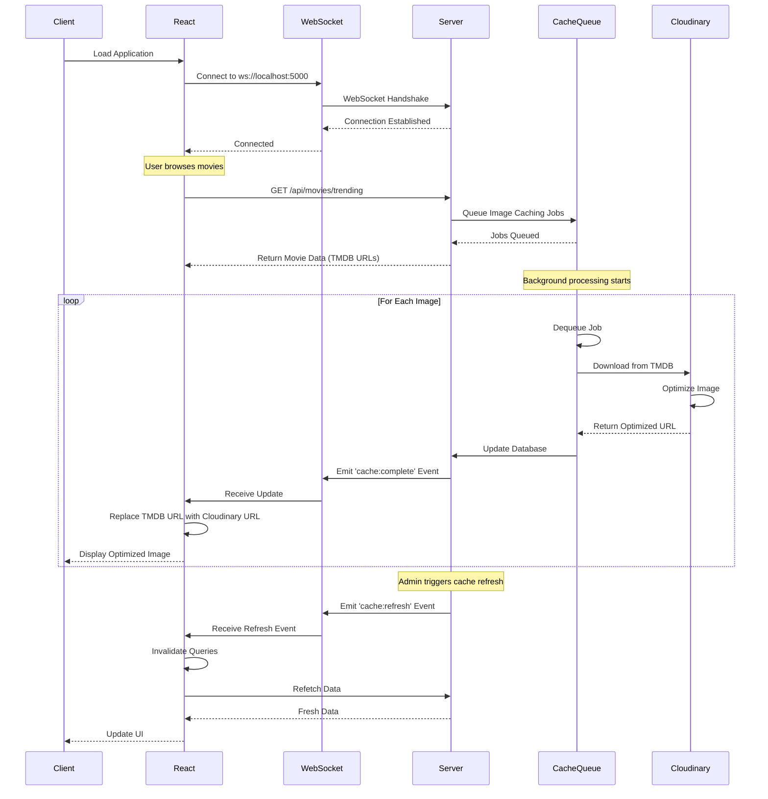

---

## Image Processing Flow

### Background Image Optimization

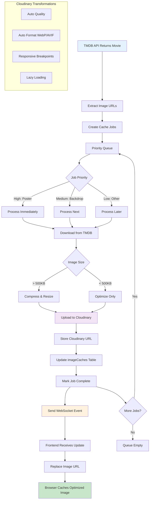

---

## Complete User Journey

### From Landing to Watching

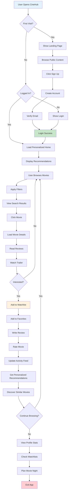

---

## Error Handling Flow

### Error Recovery Process

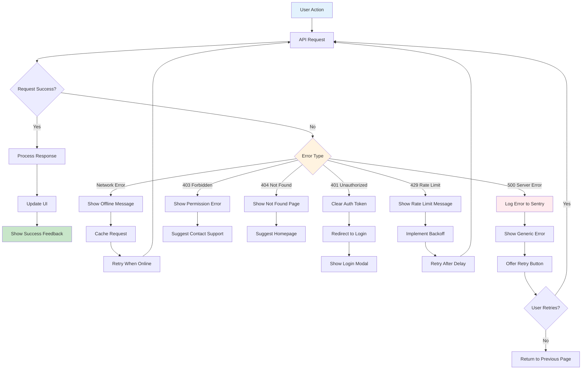

---

## Application Startup Flow

### Initial Load Sequence

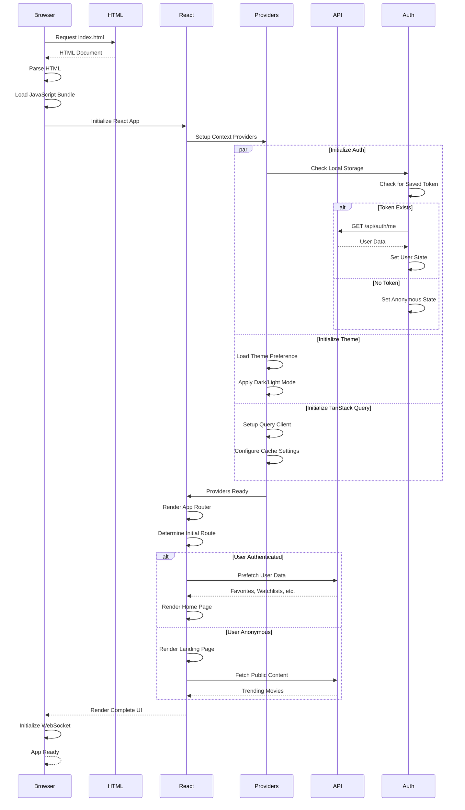

---

## Summary

These diagrams show:

1. ✅ **Complete Request-Response Flow** - End-to-end data flow
2. ✅ **Authentication Flows** - Sign up, login, and OAuth
3. ✅ **Movie Discovery** - Browse, filter, and details
4. ✅ **Watchlist Management** - Add and view watchlists
5. ✅ **Review System** - Write and submit reviews
6. ✅ **Caching Strategy** - Three-layer caching
7. ✅ **Real-time Updates** - WebSocket communication
8. ✅ **Image Processing** - Background optimization
9. ✅ **User Journey** - Complete user experience
10. ✅ **Error Handling** - Recovery processes
11. ✅ **Application Startup** - Initial load sequence

All flows are designed to be clear, comprehensive, and developer-friendly.

---

**Last Updated:** October 29, 2025
