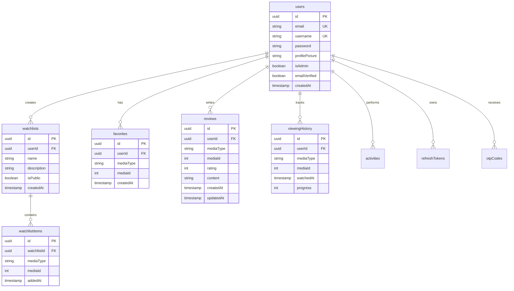
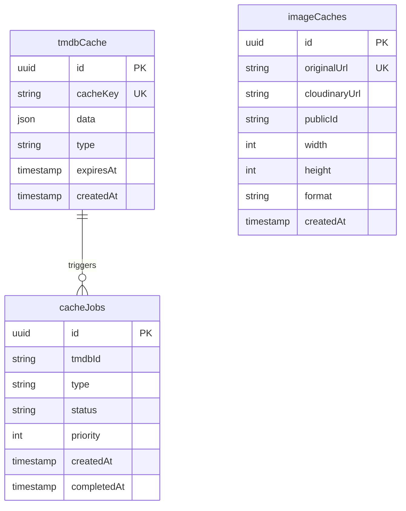
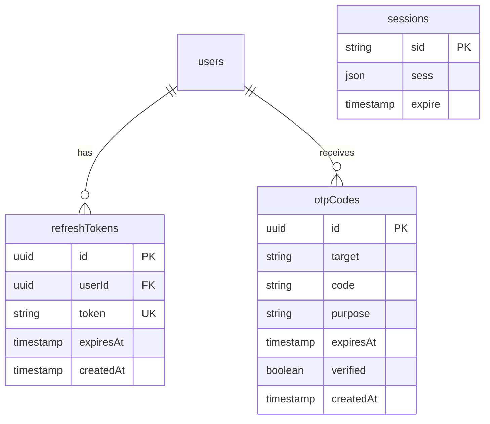

# Database Schema Documentation

Complete database schema documentation for CineHub Pro, including entity relationships, table structures, and migration guidelines.

## Table of Contents

- [Overview](#overview)
- [Entity Relationship Diagram](#entity-relationship-diagram)
- [Table Structures](#table-structures)
- [Relationships](#relationships)
- [Indexes](#indexes)
- [Migration Guide](#migration-guide)
- [Data Integrity](#data-integrity)

## Overview

CineHub Pro uses PostgreSQL as its primary database with Drizzle ORM for type-safe database operations. The schema is designed to support:

- User authentication and profiles
- Movie and TV show collections
- Social features (reviews, favorites)
- Admin functionality
- TMDB data caching
- Image optimization tracking

**Database Technology:**
- **Primary**: PostgreSQL (Neon Serverless)
- **ORM**: Drizzle ORM
- **Migration Tool**: Drizzle Kit
- **Recommendations**: SQLite (separate local database)

## Entity Relationship Diagram

### Core User and Content Management



### Caching and Performance



### Authentication and Security



## Table Structures

### Users Table

Primary table for user accounts and authentication.

**Table Name:** `users`

| Column | Type | Constraints | Description |
|--------|------|-------------|-------------|
| id | UUID | PRIMARY KEY, DEFAULT gen_random_uuid() | Unique user identifier |
| email | VARCHAR(255) | UNIQUE, NOT NULL | User email address |
| username | VARCHAR(50) | UNIQUE, NOT NULL | Display name |
| password | VARCHAR(255) | NOT NULL | bcrypt hashed password |
| profilePicture | TEXT | NULL | Cloudinary URL or path |
| isAdmin | BOOLEAN | DEFAULT false | Admin privileges flag |
| emailVerified | BOOLEAN | DEFAULT false | Email verification status |
| phoneNumber | VARCHAR(20) | NULL | Phone for OTP |
| createdAt | TIMESTAMP | DEFAULT NOW() | Account creation time |

**Indexes:**
- `idx_users_email` on `email`
- `idx_users_username` on `username`

**Sample Query:**
```sql
-- Create new user
INSERT INTO users (email, username, password)
VALUES ('user@example.com', 'johndoe', '$2b$10$...')
RETURNING id, email, username;

-- Find user by email
SELECT id, email, username, isAdmin
FROM users
WHERE email = 'user@example.com';
```

### Watchlists Table

User-created collections of movies and TV shows.

**Table Name:** `watchlists`

| Column | Type | Constraints | Description |
|--------|------|-------------|-------------|
| id | UUID | PRIMARY KEY | Unique watchlist ID |
| userId | UUID | FOREIGN KEY (users.id), NOT NULL | Owner user ID |
| name | VARCHAR(100) | NOT NULL | Watchlist name |
| description | TEXT | NULL | Optional description |
| isPublic | BOOLEAN | DEFAULT false | Visibility flag |
| createdAt | TIMESTAMP | DEFAULT NOW() | Creation timestamp |

**Indexes:**
- `idx_watchlists_userId` on `userId`

**Sample Query:**
```sql
-- Get all watchlists for a user
SELECT id, name, description, isPublic
FROM watchlists
WHERE userId = 'user-uuid'
ORDER BY createdAt DESC;
```

### Watchlist Items Table

Individual items within watchlists.

**Table Name:** `watchlistItems`

| Column | Type | Constraints | Description |
|--------|------|-------------|-------------|
| id | UUID | PRIMARY KEY | Unique item ID |
| watchlistId | UUID | FOREIGN KEY (watchlists.id), NOT NULL | Parent watchlist |
| mediaType | VARCHAR(10) | NOT NULL | 'movie' or 'tv' |
| mediaId | INTEGER | NOT NULL | TMDB ID |
| addedAt | TIMESTAMP | DEFAULT NOW() | When added |

**Composite Index:**
- `idx_watchlistItems_unique` on `(watchlistId, mediaType, mediaId)` - prevents duplicates

**Sample Query:**
```sql
-- Add item to watchlist
INSERT INTO watchlistItems (watchlistId, mediaType, mediaId)
VALUES ('watchlist-uuid', 'movie', 550);

-- Get all items in a watchlist
SELECT mediaType, mediaId, addedAt
FROM watchlistItems
WHERE watchlistId = 'watchlist-uuid'
ORDER BY addedAt DESC;
```

### Favorites Table

User's favorite movies and TV shows.

**Table Name:** `favorites`

| Column | Type | Constraints | Description |
|--------|------|-------------|-------------|
| id | UUID | PRIMARY KEY | Unique favorite ID |
| userId | UUID | FOREIGN KEY (users.id), NOT NULL | User ID |
| mediaType | VARCHAR(10) | NOT NULL | 'movie' or 'tv' |
| mediaId | INTEGER | NOT NULL | TMDB ID |
| createdAt | TIMESTAMP | DEFAULT NOW() | When favorited |

**Composite Unique Index:**
- `idx_favorites_unique` on `(userId, mediaType, mediaId)`

**Sample Query:**
```sql
-- Add to favorites
INSERT INTO favorites (userId, mediaType, mediaId)
VALUES ('user-uuid', 'movie', 550)
ON CONFLICT DO NOTHING;

-- Check if favorited
SELECT EXISTS(
  SELECT 1 FROM favorites
  WHERE userId = 'user-uuid'
    AND mediaType = 'movie'
    AND mediaId = 550
);
```

### Reviews Table

User reviews and ratings for content.

**Table Name:** `reviews`

| Column | Type | Constraints | Description |
|--------|------|-------------|-------------|
| id | UUID | PRIMARY KEY | Unique review ID |
| userId | UUID | FOREIGN KEY (users.id), NOT NULL | Reviewer ID |
| mediaType | VARCHAR(10) | NOT NULL | 'movie' or 'tv' |
| mediaId | INTEGER | NOT NULL | TMDB ID |
| rating | INTEGER | CHECK (rating >= 1 AND rating <= 10) | 1-10 rating |
| content | TEXT | NULL | Review text |
| createdAt | TIMESTAMP | DEFAULT NOW() | Created timestamp |
| updatedAt | TIMESTAMP | DEFAULT NOW() | Last updated |

**Indexes:**
- `idx_reviews_media` on `(mediaType, mediaId)`
- `idx_reviews_userId` on `userId`

**Sample Query:**
```sql
-- Create review
INSERT INTO reviews (userId, mediaType, mediaId, rating, content)
VALUES ('user-uuid', 'movie', 550, 9, 'Amazing movie!')
RETURNING id, rating, content, createdAt;

-- Get reviews for a movie
SELECT r.id, r.rating, r.content, r.createdAt,
       u.username, u.profilePicture
FROM reviews r
JOIN users u ON r.userId = u.id
WHERE r.mediaType = 'movie' AND r.mediaId = 550
ORDER BY r.createdAt DESC;
```

### Viewing History Table

Tracks what users have watched.

**Table Name:** `viewingHistory`

| Column | Type | Constraints | Description |
|--------|------|-------------|-------------|
| id | UUID | PRIMARY KEY | Unique history ID |
| userId | UUID | FOREIGN KEY (users.id), NOT NULL | User ID |
| mediaType | VARCHAR(10) | NOT NULL | 'movie' or 'tv' |
| mediaId | INTEGER | NOT NULL | TMDB ID |
| watchedAt | TIMESTAMP | DEFAULT NOW() | When watched |
| progress | INTEGER | DEFAULT 0 | Watch progress (0-100%) |

**Indexes:**
- `idx_viewingHistory_userId` on `userId`
- `idx_viewingHistory_watchedAt` on `watchedAt`

**Sample Query:**
```sql
-- Log viewing activity
INSERT INTO viewingHistory (userId, mediaType, mediaId, progress)
VALUES ('user-uuid', 'movie', 550, 100);

-- Get recent viewing history
SELECT mediaType, mediaId, watchedAt, progress
FROM viewingHistory
WHERE userId = 'user-uuid'
ORDER BY watchedAt DESC
LIMIT 20;
```

### Activities Table

User activity feed.

**Table Name:** `activities`

| Column | Type | Constraints | Description |
|--------|------|-------------|-------------|
| id | UUID | PRIMARY KEY | Unique activity ID |
| userId | UUID | FOREIGN KEY (users.id), NOT NULL | User ID |
| type | VARCHAR(50) | NOT NULL | Activity type |
| mediaType | VARCHAR(10) | NULL | Related media type |
| mediaId | INTEGER | NULL | Related media ID |
| metadata | JSON | NULL | Additional data |
| createdAt | TIMESTAMP | DEFAULT NOW() | Activity timestamp |

**Activity Types:**
- `favorite_added`
- `review_posted`
- `watchlist_created`
- `item_watched`

**Indexes:**
- `idx_activities_userId` on `userId`
- `idx_activities_createdAt` on `createdAt`

### TMDB Cache Table

Cached TMDB API responses.

**Table Name:** `tmdbCache`

| Column | Type | Constraints | Description |
|--------|------|-------------|-------------|
| id | UUID | PRIMARY KEY | Unique cache ID |
| cacheKey | VARCHAR(255) | UNIQUE, NOT NULL | Cache key |
| data | JSON | NOT NULL | Cached response |
| type | VARCHAR(50) | NOT NULL | Cache type |
| expiresAt | TIMESTAMP | NOT NULL | Expiration time |
| createdAt | TIMESTAMP | DEFAULT NOW() | Cache creation |

**Cache Types:**
- `movie_details`
- `tv_details`
- `person_details`
- `trending_movies`
- `popular_movies`
- `discover_results`

**Indexes:**
- `idx_tmdbCache_cacheKey` on `cacheKey`
- `idx_tmdbCache_expiresAt` on `expiresAt`

**Sample Query:**
```sql
-- Get cached data
SELECT data FROM tmdbCache
WHERE cacheKey = 'movie:550'
  AND expiresAt > NOW();

-- Clean expired cache
DELETE FROM tmdbCache
WHERE expiresAt < NOW();
```

### Image Cache Table

Cloudinary image optimization tracking.

**Table Name:** `imageCaches`

| Column | Type | Constraints | Description |
|--------|------|-------------|-------------|
| id | UUID | PRIMARY KEY | Unique cache ID |
| originalUrl | TEXT | UNIQUE, NOT NULL | Original TMDB URL |
| cloudinaryUrl | TEXT | NOT NULL | Optimized URL |
| publicId | VARCHAR(255) | NOT NULL | Cloudinary public ID |
| width | INTEGER | NULL | Image width |
| height | INTEGER | NULL | Image height |
| format | VARCHAR(10) | NULL | Image format |
| createdAt | TIMESTAMP | DEFAULT NOW() | Upload time |

**Indexes:**
- `idx_imageCaches_originalUrl` on `originalUrl`

### Cache Jobs Table

Background image caching job queue.

**Table Name:** `cacheJobs`

| Column | Type | Constraints | Description |
|--------|------|-------------|-------------|
| id | UUID | PRIMARY KEY | Unique job ID |
| tmdbId | VARCHAR(50) | NOT NULL | TMDB resource ID |
| type | VARCHAR(20) | NOT NULL | 'movie', 'tv', 'person' |
| status | VARCHAR(20) | DEFAULT 'pending' | Job status |
| priority | INTEGER | DEFAULT 0 | Job priority |
| createdAt | TIMESTAMP | DEFAULT NOW() | Job creation |
| completedAt | TIMESTAMP | NULL | Completion time |

**Job Statuses:**
- `pending`
- `processing`
- `completed`
- `failed`

**Indexes:**
- `idx_cacheJobs_status` on `status`
- `idx_cacheJobs_priority` on `priority`

### Refresh Tokens Table

JWT refresh token storage.

**Table Name:** `refreshTokens`

| Column | Type | Constraints | Description |
|--------|------|-------------|-------------|
| id | UUID | PRIMARY KEY | Unique token ID |
| userId | UUID | FOREIGN KEY (users.id), NOT NULL | User ID |
| token | VARCHAR(500) | UNIQUE, NOT NULL | Refresh token |
| expiresAt | TIMESTAMP | NOT NULL | Token expiration |
| createdAt | TIMESTAMP | DEFAULT NOW() | Token creation |

**Indexes:**
- `idx_refreshTokens_token` on `token`
- `idx_refreshTokens_userId` on `userId`

### OTP Codes Table

One-time password verification codes.

**Table Name:** `otpCodes`

| Column | Type | Constraints | Description |
|--------|------|-------------|-------------|
| id | UUID | PRIMARY KEY | Unique OTP ID |
| target | VARCHAR(255) | NOT NULL | Email or phone |
| code | VARCHAR(10) | NOT NULL | 6-digit code |
| purpose | VARCHAR(20) | NOT NULL | OTP purpose |
| expiresAt | TIMESTAMP | NOT NULL | Code expiration |
| verified | BOOLEAN | DEFAULT false | Verification status |
| createdAt | TIMESTAMP | DEFAULT NOW() | Code creation |

**OTP Purposes:**
- `signup`
- `login`
- `reset`
- `verify`

**Indexes:**
- `idx_otpCodes_target` on `target`

## Relationships

### One-to-Many Relationships

```typescript
// User has many watchlists
users.id → watchlists.userId

// User has many favorites
users.id → favorites.userId

// User has many reviews
users.id → reviews.userId

// User has many viewing history entries
users.id → viewingHistory.userId

// User has many activities
users.id → activities.userId

// User has many refresh tokens
users.id → refreshTokens.userId

// Watchlist has many items
watchlists.id → watchlistItems.watchlistId
```

### Cascade Behaviors

```sql
-- Delete user → cascade delete all related data
ALTER TABLE watchlists
ADD CONSTRAINT fk_watchlists_userId
FOREIGN KEY (userId) REFERENCES users(id)
ON DELETE CASCADE;

-- Delete watchlist → cascade delete all items
ALTER TABLE watchlistItems
ADD CONSTRAINT fk_watchlistItems_watchlistId
FOREIGN KEY (watchlistId) REFERENCES watchlists(id)
ON DELETE CASCADE;
```

## Indexes

### Performance Indexes

```sql
-- User lookup indexes
CREATE INDEX idx_users_email ON users(email);
CREATE INDEX idx_users_username ON users(username);

-- Favorites lookup
CREATE UNIQUE INDEX idx_favorites_unique 
ON favorites(userId, mediaType, mediaId);

-- Reviews by media
CREATE INDEX idx_reviews_media ON reviews(mediaType, mediaId);

-- Activity feed
CREATE INDEX idx_activities_userId_createdAt 
ON activities(userId, createdAt DESC);

-- Cache cleanup
CREATE INDEX idx_tmdbCache_expiresAt ON tmdbCache(expiresAt);

-- Job queue processing
CREATE INDEX idx_cacheJobs_status_priority 
ON cacheJobs(status, priority DESC);
```

## Migration Guide

### Running Migrations

CineHub uses Drizzle Kit for schema migrations:

```bash
# Push schema changes to database
npm run db:push

# Generate migration files
npx drizzle-kit generate

# Apply migrations
npx drizzle-kit migrate
```

### Schema Updates

**1. Adding a new column:**

```typescript
// shared/schema.ts
export const users = pgTable('users', {
  id: uuid('id').primaryKey().defaultRandom(),
  email: varchar('email', { length: 255 }).unique().notNull(),
  // ... existing columns
  newColumn: varchar('new_column', { length: 100 }), // Add this
});
```

**2. Creating a new table:**

```typescript
export const newTable = pgTable('new_table', {
  id: uuid('id').primaryKey().defaultRandom(),
  userId: uuid('user_id').references(() => users.id),
  createdAt: timestamp('created_at').defaultNow(),
});
```

**3. Run migration:**

```bash
npm run db:push
```

### Data Migration Scripts

For complex data migrations, create a script:

```typescript
// scripts/migrate-data.ts
import { db } from '../server/db';
import { users } from '../shared/schema';

async function migrateData() {
  // Example: Add default values for existing records
  await db.update(users)
    .set({ emailVerified: false })
    .where(sql`email_verified IS NULL`);
}

migrateData();
```

## Data Integrity

### Constraints

**Unique Constraints:**
```sql
-- Prevent duplicate favorites
UNIQUE(userId, mediaType, mediaId) ON favorites

-- Prevent duplicate watchlist items
UNIQUE(watchlistId, mediaType, mediaId) ON watchlistItems

-- Unique email and username
UNIQUE(email) ON users
UNIQUE(username) ON users
```

**Check Constraints:**
```sql
-- Rating must be 1-10
CHECK (rating >= 1 AND rating <= 10) ON reviews

-- Progress must be 0-100
CHECK (progress >= 0 AND progress <= 100) ON viewingHistory

-- Media type must be valid
CHECK (mediaType IN ('movie', 'tv')) ON favorites, reviews, etc.
```

### Referential Integrity

All foreign keys enforce referential integrity:

```sql
-- Cannot create watchlist for non-existent user
FOREIGN KEY (userId) REFERENCES users(id)

-- Cannot delete user with existing watchlists (use CASCADE)
ON DELETE CASCADE
```

### Data Validation

Application-level validation using Zod:

```typescript
import { z } from 'zod';

export const insertReviewSchema = z.object({
  mediaType: z.enum(['movie', 'tv']),
  mediaId: z.number().int().positive(),
  rating: z.number().int().min(1).max(10),
  content: z.string().min(1).max(5000).optional(),
});
```

## Backup and Recovery

### Automated Backups

```bash
# Daily backup script
pg_dump $DATABASE_URL > backup-$(date +%Y%m%d).sql

# Restore from backup
psql $DATABASE_URL < backup-20250129.sql
```

### Point-in-Time Recovery

Neon PostgreSQL provides automatic point-in-time recovery:

```bash
# Restore to specific timestamp
neon branches create --parent main --timestamp 2025-01-29T12:00:00Z
```

## Query Optimization

### Common Queries

**Get user's complete profile:**
```sql
SELECT 
  u.*,
  COUNT(DISTINCT f.id) as favorites_count,
  COUNT(DISTINCT w.id) as watchlists_count,
  COUNT(DISTINCT r.id) as reviews_count
FROM users u
LEFT JOIN favorites f ON f.userId = u.id
LEFT JOIN watchlists w ON w.userId = u.id
LEFT JOIN reviews r ON r.userId = u.id
WHERE u.id = 'user-uuid'
GROUP BY u.id;
```

**Get trending reviews:**
```sql
SELECT 
  r.*,
  u.username,
  u.profilePicture
FROM reviews r
JOIN users u ON r.userId = u.id
WHERE r.createdAt > NOW() - INTERVAL '7 days'
ORDER BY r.createdAt DESC
LIMIT 20;
```

## Database Schema File

The complete schema is defined in [`shared/schema.ts`](../shared/schema.ts) using Drizzle ORM.

## Additional Resources

- [Drizzle ORM Documentation](https://orm.drizzle.team/)
- [PostgreSQL Documentation](https://www.postgresql.org/docs/)
- [Neon Documentation](https://neon.tech/docs)
- [Database Indexing Best Practices](https://use-the-index-luke.com/)

---

**Last Updated:** October 29, 2025
