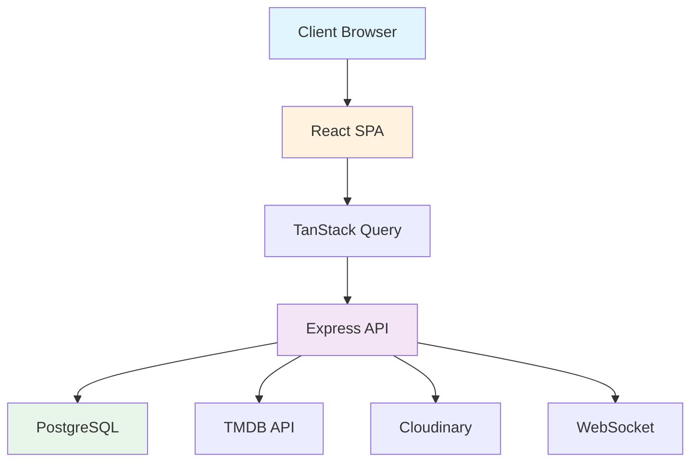

# CineHub Pro Documentation

Welcome to the comprehensive documentation for CineHub Pro - a modern, full-stack movie and TV show discovery platform.

## 📚 Quick Navigation

### Getting Started
- **[Project Overview](../README.md)** - Start here for a high-level overview
- **[Setup Guide](SETUP.md)** - Step-by-step installation instructions
- **[Environment Variables](ENVIRONMENT_VARIABLES.md)** - Configuration guide

### For Developers
- **[Developer Guide](DEVELOPER_GUIDE.md)** - Development workflow and best practices
- **[Architecture](ARCHITECTURE.md)** - System design and technical architecture
- **[Folder Structure](FOLDER_STRUCTURE.md)** - Complete project organization guide
- **[Code Documentation](CODE_DOCUMENTATION.md)** - Coding standards and JSDoc guidelines
- **[API Reference](API.md)** - Complete REST API documentation
- **[Database Schema](DATABASE_SCHEMA.md)** - Database structure and ERD diagrams

### Testing & Quality
- **[Testing Guide](TESTING.md)** - Comprehensive testing strategy
- **[Testing Notes](TESTING_NOTES.md)** - Best practices and coverage goals

### Deployment
- **[Deployment Guide](DEPLOYMENT.md)** - Production deployment instructions
- **[EC2 Deployment](DEPLOYMENT_EC2.md)** - AWS EC2 specific guide
- **[Amazon Linux Setup](DEPLOY_AMAZON_LINUX.md)** - Amazon Linux 2 deployment
- **[GitHub Actions](GITHUB_ACTIONS.md)** - CI/CD workflow setup

### Contributing
- **[Contributing Guidelines](CONTRIBUTING.md)** - How to contribute
- **[Security Policy](SECURITY.md)** - Security guidelines and reporting

### User Documentation
- **[User Guide](USER_GUIDE.md)** - End-user manual
- **[FAQ](FAQ.md)** - Frequently asked questions
- **[Troubleshooting](TROUBLESHOOTING.md)** - Common issues and solutions

### Project Information
- **[Changelog](../CHANGELOG.md)** - Version history and release notes
- **[Future Enhancements](FUTURE_ENHANCEMENTS.md)** - Roadmap and planned features
- **[License](../LICENSE)** - MIT License

## 🎯 Documentation by Topic

### Architecture & Design

#### System Overview


#### Key Technologies
- **Frontend**: React 18, TypeScript, Vite, Tailwind CSS
- **Backend**: Node.js, Express.js, TypeScript
- **Database**: PostgreSQL (Neon), SQLite (Recommendations)
- **APIs**: TMDB, Cloudinary, SendGrid, Twilio
- **State**: TanStack Query, Context API
- **Testing**: Vitest, Testing Library, Cypress

### Features Overview

#### Core Features
✅ Movie & TV show discovery with advanced filtering  
✅ Personalized collections (watchlists, favorites)  
✅ Social features (reviews, ratings)  
✅ Smart caching (TMDB data, images)  
✅ Real-time updates via WebSockets  
✅ Dark mode support  
✅ Full accessibility (WCAG 2.1)  

#### Authentication
✅ Email/password with bcrypt  
✅ Social login (Google, Facebook, GitHub, X)  
✅ OTP verification (email/SMS)  
✅ JWT + session-based auth  
✅ Password reset  

#### Admin Features
✅ User management dashboard  
✅ Platform analytics  
✅ Content moderation  

#### Recommendations
✅ Zero-cost local recommendation engine  
✅ Trending movies algorithm  
✅ Genre-based similarity  
✅ Personalized suggestions  

## 🚀 Quick Start Guide

### 1. Prerequisites
- Node.js 20+
- PostgreSQL (or Neon account)
- TMDB API key

### 2. Installation
```bash
# Clone repository
git clone <repository-url>
cd cinehub-pro

# Install dependencies
npm install

# Setup environment
cp .env.example .env
# Edit .env with your configuration

# Setup database
npm run db:push

# Start development server
npm run dev
```

### 3. Access Application
Open http://localhost:5000 in your browser

For detailed setup instructions, see the [Setup Guide](SETUP.md).

## 📖 Documentation Structure

### Documentation Files

This documentation suite includes:

1. **Setup & Configuration** (3 files)
   - SETUP.md - Installation guide
   - ENVIRONMENT_VARIABLES.md - Config reference
   - FOLDER_STRUCTURE.md - Project organization

2. **Architecture & Development** (5 files)
   - ARCHITECTURE.md - System design
   - DATABASE_SCHEMA.md - Database documentation
   - API.md - API reference
   - DEVELOPER_GUIDE.md - Development workflow
   - CODE_DOCUMENTATION.md - Coding standards

3. **Testing** (2 files)
   - TESTING.md - Testing guide
   - TESTING_NOTES.md - Best practices

4. **Deployment** (4 files)
   - DEPLOYMENT.md - General deployment
   - DEPLOYMENT_EC2.md - EC2 deployment
   - DEPLOY_AMAZON_LINUX.md - Amazon Linux
   - GITHUB_ACTIONS.md - CI/CD workflows

5. **Contributing** (3 files)
   - CONTRIBUTING.md - Contribution guide
   - SECURITY.md - Security policy
   - FUTURE_ENHANCEMENTS.md - Roadmap

6. **User Help** (3 files)
   - USER_GUIDE.md - User manual
   - FAQ.md - Common questions
   - TROUBLESHOOTING.md - Problem solving

## 🎓 Learning Paths

### For New Developers

1. Read [Project Overview](../README.md)
2. Follow [Setup Guide](SETUP.md)
3. Review [Architecture](ARCHITECTURE.md)
4. Study [Folder Structure](FOLDER_STRUCTURE.md)
5. Check [Developer Guide](DEVELOPER_GUIDE.md)
6. Review [Testing Guide](TESTING.md)
7. Read [Contributing Guidelines](CONTRIBUTING.md)

### For DevOps Engineers

1. Review [Architecture](ARCHITECTURE.md)
2. Study [Environment Variables](ENVIRONMENT_VARIABLES.md)
3. Read [Deployment Guide](DEPLOYMENT.md)
4. Review [GitHub Actions](GITHUB_ACTIONS.md)
5. Check [Security Policy](SECURITY.md)

### For End Users

1. Read [User Guide](USER_GUIDE.md)
2. Check [FAQ](FAQ.md)
3. Review [Troubleshooting](TROUBLESHOOTING.md)

## 🔧 Common Tasks

### Development

```bash
# Start development server
npm run dev

# Run type checking
npm run check

# Run tests
npm test

# Run tests with coverage
npm run test:coverage

# Build for production
npm run build
```

### Database

```bash
# Push schema changes
npm run db:push

# Seed recommendations database
cd server && node seed.cjs

# Precompute recommendations
cd server && node precompute.cjs
```

### Testing

```bash
# Run all tests
npm test

# Unit tests only
npm run test:unit

# Integration tests
npm run test:integration

# Component tests
npm run test:components

# E2E tests with Cypress
npm run cypress
```

### Deployment

```bash
# Build for production
npm run build

# Start production server
npm start
```

## 📊 Project Statistics

- **Total Lines of Code**: ~25,000+
- **Test Coverage**: 90%+
- **Components**: 50+
- **API Endpoints**: 40+
- **Database Tables**: 15+
- **Documentation Pages**: 20+

## 🤝 Contributing

We welcome contributions! Please see our [Contributing Guidelines](CONTRIBUTING.md) for details.

### Ways to Contribute

- 🐛 Report bugs
- 💡 Suggest features
- 📝 Improve documentation
- 🧪 Write tests
- 💻 Submit code

## 🔗 External Resources

### APIs & Services
- [TMDB API](https://www.themoviedb.org/settings/api) - Movie database
- [Cloudinary](https://cloudinary.com/) - Image hosting
- [Neon](https://neon.tech/) - Serverless PostgreSQL
- [SendGrid](https://sendgrid.com/) - Email delivery
- [Twilio](https://www.twilio.com/) - SMS delivery

### Libraries & Frameworks
- [React](https://react.dev/) - UI library
- [Vite](https://vitejs.dev/) - Build tool
- [TanStack Query](https://tanstack.com/query) - Data fetching
- [Drizzle ORM](https://orm.drizzle.team/) - Database ORM
- [Tailwind CSS](https://tailwindcss.com/) - Styling
- [Radix UI](https://www.radix-ui.com/) - Component primitives

### Development Tools
- [TypeScript](https://www.typescriptlang.org/) - Type safety
- [Vitest](https://vitest.dev/) - Testing framework
- [Cypress](https://www.cypress.io/) - E2E testing

## 📞 Support

### Get Help

- **GitHub Issues**: [Report bugs](https://github.com/yourusername/cinehub-pro/issues)
- **GitHub Discussions**: [Ask questions](https://github.com/yourusername/cinehub-pro/discussions)
- **Discord**: [Join community](https://discord.gg/cinehubpro)
- **Email**: support@cinehubpro.com

### Documentation Feedback

Found an error or have a suggestion for the documentation?

- Open an issue on GitHub
- Submit a pull request
- Email docs@cinehubpro.com

## 📝 Documentation Maintenance

### Last Updated
- **Date**: October 29, 2025
- **Version**: 1.0.0
- **Maintainer**: CineHub Pro Team

### Update Schedule
- **Major updates**: With each major release
- **Minor updates**: As features are added
- **Patches**: As bugs are fixed or clarifications needed

### Documentation Standards

All documentation follows:
- Markdown formatting
- Clear heading hierarchy
- Code examples where applicable
- Mermaid diagrams for visuals
- Links to related documents
- Last updated date

## 🗺️ Sitemap

```
docs/
├── README.md (this file)
├── SETUP.md
├── ARCHITECTURE.md
├── DATABASE_SCHEMA.md
├── FOLDER_STRUCTURE.md
├── API.md
├── TESTING.md
├── DEPLOYMENT.md
├── CONTRIBUTING.md
├── USER_GUIDE.md
├── FUTURE_ENHANCEMENTS.md
└── ... (see full list above)
```

## 📄 License

This project is licensed under the MIT License - see the [LICENSE](../LICENSE) file for details.

---

**[Back to Project Root](../README.md)** | **[View All Documentation](DOCUMENTATION_INDEX.md)**
