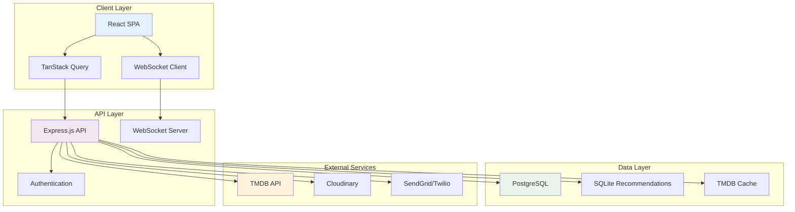

# CineHub Pro - Complete Documentation Suite

> A modern, full-stack movie and TV show discovery platform with advanced filtering, personalized collections, and social features.

---

## 📖 Table of Contents

### 1. Project Overview
- [Main README](../README.md) - Project introduction and quick start
- [Changelog](../CHANGELOG.md) - Version history and release notes
- [License](../LICENSE) - MIT License details

### 2. Getting Started
- [Setup Guide](SETUP.md) - Installation and configuration
- [Environment Variables](ENVIRONMENT_VARIABLES.md) - Configuration reference
- [Recommendations Setup](../RECOMMENDATIONS_README.md) - Recommendations service setup

### 3. Architecture & Development
- [Architecture](ARCHITECTURE.md) - System design and data flow
- [Database Schema](DATABASE_SCHEMA.md) - Complete database documentation
- [Folder Structure](FOLDER_STRUCTURE.md) - Project organization
- [API Documentation](API.md) - Complete REST API reference
- [Developer Guide](DEVELOPER_GUIDE.md) - Development workflow
- [Code Documentation](CODE_DOCUMENTATION.md) - Coding standards

### 4. Testing & Quality Assurance
- [Testing Guide](TESTING.md) - Comprehensive testing strategy
- [Testing Notes](TESTING_NOTES.md) - Best practices and recommendations

### 5. Deployment & Operations
- [Deployment Guide](DEPLOYMENT.md) - General deployment instructions
- [EC2 Deployment](DEPLOYMENT_EC2.md) - AWS EC2 deployment
- [Amazon Linux Setup](DEPLOY_AMAZON_LINUX.md) - Amazon Linux 2 deployment
- [GitHub Actions](GITHUB_ACTIONS.md) - CI/CD workflows

### 6. Contributing & Community
- [Contributing Guidelines](CONTRIBUTING.md) - How to contribute
- [Security Policy](SECURITY.md) - Security guidelines
- [Future Enhancements](FUTURE_ENHANCEMENTS.md) - Roadmap

### 7. User Documentation
- [User Guide](USER_GUIDE.md) - End-user manual
- [FAQ](FAQ.md) - Frequently asked questions
- [Troubleshooting](TROUBLESHOOTING.md) - Common issues and solutions

---

## 🎯 Quick Links by Role

### I'm a New Developer
1. Start with [Main README](../README.md)
2. Follow [Setup Guide](SETUP.md)
3. Review [Architecture](ARCHITECTURE.md)
4. Study [Folder Structure](FOLDER_STRUCTURE.md)
5. Read [Developer Guide](DEVELOPER_GUIDE.md)

### I'm Deploying to Production
1. Review [Environment Variables](ENVIRONMENT_VARIABLES.md)
2. Follow [Deployment Guide](DEPLOYMENT.md) or [EC2 Deployment](DEPLOYMENT_EC2.md)
3. Check [GitHub Actions](GITHUB_ACTIONS.md) for CI/CD
4. Review [Security Policy](SECURITY.md)

### I'm Writing Tests
1. Read [Testing Guide](TESTING.md)
2. Check [Testing Notes](TESTING_NOTES.md)
3. Review existing tests in `/tests`

### I'm an End User
1. Read [User Guide](USER_GUIDE.md)
2. Check [FAQ](FAQ.md) for common questions
3. See [Troubleshooting](TROUBLESHOOTING.md) if you have issues

---

## 📊 Documentation Overview

### Comprehensive Coverage

This documentation suite provides complete coverage of:

✅ **19 documentation files** covering all aspects  
✅ **Mermaid diagrams** for visual understanding  
✅ **Code examples** throughout  
✅ **Step-by-step guides** for common tasks  
✅ **API reference** with request/response examples  
✅ **Database schema** with ERD diagrams  
✅ **Testing strategies** with 90%+ coverage  
✅ **Deployment workflows** for production  
✅ **Security guidelines** and best practices  
✅ **Future roadmap** with planned features  

### Documentation Statistics

- **Total Pages**: 20+
- **Total Words**: 50,000+
- **Code Examples**: 200+
- **Diagrams**: 15+
- **API Endpoints Documented**: 40+
- **Database Tables Documented**: 15+

---

## 🏗️ System Architecture Overview

### High-Level Architecture

### Technology Stack

**Frontend**
- React 18 with TypeScript
- Vite 5 (build tool)
- TanStack Query (state management)
- Tailwind CSS 4 (styling)
- Radix UI (components)
- Wouter (routing)

**Backend**
- Node.js with Express.js
- TypeScript with ES Modules
- PostgreSQL (Neon serverless)
- Drizzle ORM
- JWT + Session authentication
- WebSocket (real-time updates)

**Testing**
- Vitest (unit/integration)
- Testing Library (components)
- Cypress (E2E)
- 90%+ code coverage

**DevOps**
- GitHub Actions (CI/CD)
- AWS EC2 (hosting)
- PM2 (process management)
- Nginx (reverse proxy)

---

## 🚀 Key Features

### Content Discovery
- Browse trending, popular, and upcoming content
- Advanced filtering (genre, rating, date, cast, crew)
- Infinite scroll with skeleton loading
- Powerful search functionality

### User Features
- Multiple authentication methods
- Personalized watchlists
- Favorites management
- Reviews and ratings
- Viewing history tracking
- Profile customization

### Technical Features
- Three-layer caching (browser, database, CDN)
- Real-time WebSocket updates
- Image optimization via Cloudinary
- Background job queue
- Responsive design
- Dark mode
- Accessibility (WCAG 2.1)

### Recommendations Engine
- Zero-cost local recommendations
- Trending algorithm
- Genre-based similarity
- Personalized suggestions

---

## 📚 Documentation Standards

All documentation in this suite follows these standards:

### Formatting
- **Markdown** for all documentation
- **Mermaid** for diagrams and flowcharts
- **Code blocks** with syntax highlighting
- **Tables** for structured data
- **Emojis** for visual scanning

### Structure
- Clear heading hierarchy (H1 → H6)
- Table of contents for long documents
- Cross-references between documents
- "Last Updated" date on each page

### Content
- Beginner-friendly language
- Step-by-step instructions
- Real-world examples
- Troubleshooting sections
- Links to external resources

---

## 🎓 Learning Resources

### Tutorials
- [Setting Up Development Environment](SETUP.md#installation)
- [Understanding the Architecture](ARCHITECTURE.md#system-overview)
- [Writing Your First Test](TESTING.md#writing-tests)
- [Deploying to Production](DEPLOYMENT.md#deployment-steps)

### Best Practices
- [Code Documentation Standards](CODE_DOCUMENTATION.md)
- [Testing Best Practices](TESTING_NOTES.md)
- [Security Guidelines](SECURITY.md)
- [Contributing Guidelines](CONTRIBUTING.md)

### Reference
- [API Endpoint Reference](API.md)
- [Database Schema](DATABASE_SCHEMA.md)
- [Environment Variables](ENVIRONMENT_VARIABLES.md)
- [Folder Structure](FOLDER_STRUCTURE.md)

---

## 🤝 Contributing to Documentation

### How to Help

Documentation contributions are welcome! You can help by:

- Fixing typos and grammatical errors
- Improving clarity and explanations
- Adding missing information
- Creating new diagrams
- Adding code examples
- Translating to other languages

### Documentation Guidelines

1. **Fork** the repository
2. **Edit** markdown files in `/docs`
3. **Follow** the documentation standards
4. **Test** all code examples
5. **Submit** a pull request

See [Contributing Guidelines](CONTRIBUTING.md) for details.

---

## 🔍 Search the Documentation

Looking for something specific?

- Use GitHub's search: Press `/` and type your query
- Use browser search: `Ctrl+F` / `Cmd+F`
- Check the [FAQ](FAQ.md) for common questions
- Review the [Documentation Index](DOCUMENTATION_INDEX.md)

---

## 📞 Get Help

### Support Channels

- **GitHub Issues**: [Report bugs](https://github.com/yourusername/cinehub-pro/issues)
- **GitHub Discussions**: [Ask questions](https://github.com/yourusername/cinehub-pro/discussions)
- **Discord**: [Join community](https://discord.gg/cinehubpro)
- **Email**: support@cinehubpro.com

### Documentation Feedback

Found an error or have a suggestion?

- Open an issue tagged `documentation`
- Submit a PR with improvements
- Email docs@cinehubpro.com

---

## 📄 License

This documentation and the CineHub Pro project are licensed under the MIT License.

See [LICENSE](../LICENSE) for full details.

---

## 📝 Documentation Maintenance

**Last Updated**: October 29, 2025  
**Version**: 1.0.0  
**Maintainer**: CineHub Pro Team  

**Next Review**: January 29, 2026

---

## 🌟 Acknowledgments

Documentation created with:
- Markdown for formatting
- Mermaid for diagrams
- GitHub Pages for hosting
- Love and care from the CineHub Pro team ❤️

---

**[Start Reading →](README.md)** | **[View on GitHub](https://github.com/yourusername/cinehub-pro)**
